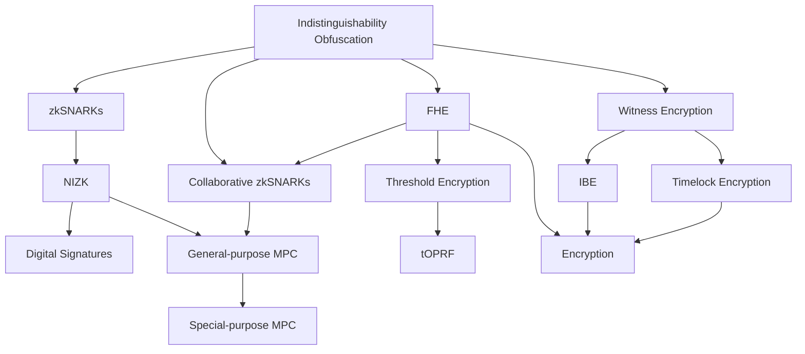

What's programmable cryptography?  [1](https://0xparc.org/blog/programmable-cryptography-1) , [2](https://www.youtube.com/watch?v=lEPqwF9gPiM), [4](https://mirror.xyz/privacy-scaling-explorations.eth/xXcRj5QfvA_qhkiZCVg46Gn9uX8P_Ld-DXlqY51roPY)
> ... an expressive language for claims [3](https://archive.devcon.org/archive/watch/6/zkps-and-programmable-cryptography/?tab=YouTube)
> Gubsheep 2022

## "Types" of Programmable Cryptography
- [[Zero Knowledge]]
- [[Secure Multiparty Computation]]
	- Special purpose MPC
		-  [[Garbled Circuits]]
- [[Homomorphic Encryption]]
- [[Private Shared States]]
![[Pasted image 20241001164919.png]]

## How to program programmable cryptography
#todo DSLs, Libraries and VMs

## What to build with Programmable Cryptography?
Read more in [[heuristics of programmable cryptography]]

## Intersections of the some of the above
- Conceptual understanding
	- Independent <> Mediated <> Global Computation [https://knot-group.github.io/wiki/building/framework/index.html](https://knot-group.github.io/wiki/building/framework/index.html)
	- Navigating Privacy on Public Blockchains: [https://wdai.us/posts/navigating-privacy/](https://wdai.us/posts/navigating-privacy/)
- Noir
	- Docs [https://noir-lang.org/docs/](https://noir-lang.org/docs/)
	- Resource registry [https://github.com/noir-lang/awesome-noir/](https://github.com/noir-lang/awesome-noir/)
	- Discord [https://discord.gg/JtqzkdeQ6G](https://discord.gg/JtqzkdeQ6G) for language specific problems and discussions
- ZKP <> MPC
	- [Paper] Collaborative zk-SNARKs: [https://eprint.iacr.org/2021/1530](https://eprint.iacr.org/2021/1530)
	- [Blog] Taceo - Private Proof Markets using MPC: [https://blog.taceo.io/private-proof-markets-using-mpc/](https://blog.taceo.io/private-proof-markets-using-mpc/)
	- [Tooling] Taceo - coSNARK in Noir: [https://github.com/TaceoLabs/collaborative-circom/tree/main/co-noir](https://github.com/TaceoLabs/collaborative-circom/tree/main/co-noir)
- ZKP <> TEE
	- [Blog] Marlin - Server-side Noir proofs with private inputs using TEEs: [https://blog.marlin.org/server-side-zk-proof-generation-for-noir-circuits-with-private-inputs-using-tees-on-kalypso](https://blog.marlin.org/server-side-zk-proof-generation-for-noir-circuits-with-private-inputs-using-tees-on-kalypso)
	- [Tooling] Marlin - Noir proving enclave: [https://github.com/marlinprotocol/noir_prover_enclave/](https://github.com/marlinprotocol/noir_prover_enclave/)
- ZKP <> FHE
	- [Blog] Christian K - Verifiable Fully Homomorphic Encryption: [https://cknabs.github.io/post/vfhe/](https://cknabs.github.io/post/vfhe/)
	- [Tooling] Christian K - zkFHE in different stacks: [https://github.com/zkFHE](https://github.com/zkFHE)**